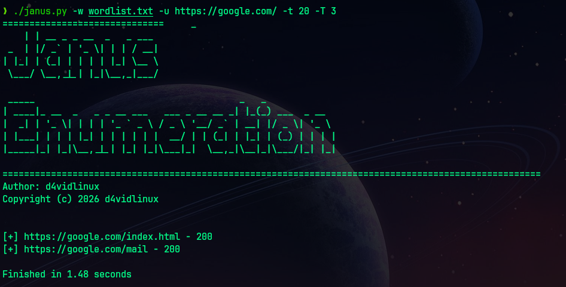
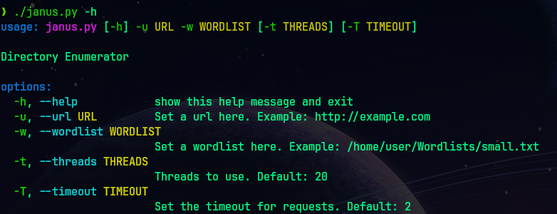

# Janus 

Janus is a multithreaded directory enumeration tool written in Python. It performs concurrent HTTP requests against a target using a supplied wordlist to discover directories and files.

The script uses the following syntax:

`python3 janus.py -u URL -w WORDLIST`

or

`./janus.py --url URL --wordlist WORDLIST`

It uses multiple threads for faster execution.



It supports several command-line flags.




```
Options

-u, --url         Target URL
-w, --wordlist    Wordlist path
-t, --threads     Number of threads
-T, --timeout     Request timeout
```

## Features 

- Multithreaded scanning
- Simple command-line interface
- Clean terminal output

## Requirements
- Python 3.x installed
- requests
- pyfiglet

## Usage

1. Clone the repository:
```bash
    git clone https://github.com/d4vidlinux/janus.git
    cd janus
```
2. Install Python:
[Download Python](https://www.python.org/downloads)

3. Create and activate a virtual environment:
```bash
    python3 -m venv venv
    source venv/bin/activate
```

4. Make the script executable (optional):
```bash
    chmod +x janus.py
```
5. Install the requirements: 
```bash
    pip install -r requirements.txt
```

6. Execute:
```bash
    python janus.py -u http://example.com -w wordlist.txt
```


